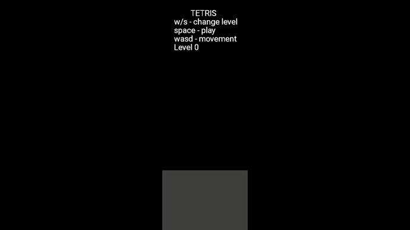

<<<<<<< HEAD
# tetris
simple tetris game with SDL2

# build on windows
I have provided 64 bit SDL2 and SDL2_TTF development package for mingw compiler.
Cmake is configured accordingly.
  using powershell navigate to root of project and:
- mkdir build 
- cd build
- cmake -G "MinGW Makefiles" ..
- cmake --build .
- run tetris
  Don't forget to copy sdl2.dll, sdl2_ttf.dll and roboto font files in your executable's directory
If you use IDE or other compiler, configure SDL accordingly.

# build on linux
using your distributions package manager download SDL2_ttf library
- mkdir build
- cd build
- cmake ..
- cmake --build .
- ./tetris

# preview

=======
# tetris
simple tetris game with SDL2

# build on linux
install cmake SDL2 SDL2_ttf according to your distribution
- mkdir build
- cd build
- cmake ..
- make
- run program

# build on windows
I have provided 64 bit SDL2 and SDL2_TTF development package for mingw compiler.
Cmake is configured accordingly.
  using powershell navigate to root of project and:
- mkdir build 
- cd build
- cmake -G "MinGW Makefiles" ..
- cmake --build .
- run tetris
  Don't forget to copy sdl2.dll, sdl2_ttf.dll and roboto font files in your executable's directory
If you use IDE or other compiler, configure SDL accordingly.

# preview

>>>>>>> 7279f7479b37c879992238731e1f1a5c9b9cf82f
